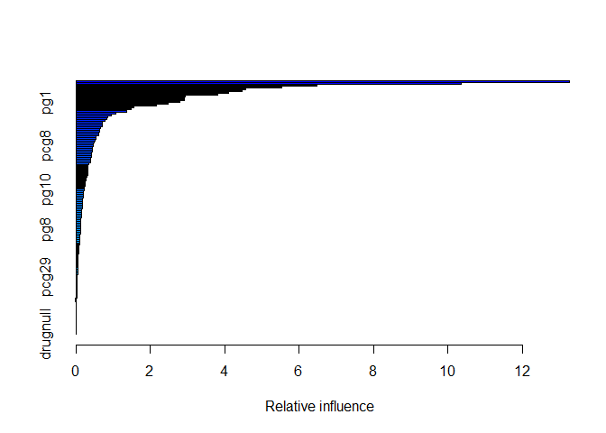
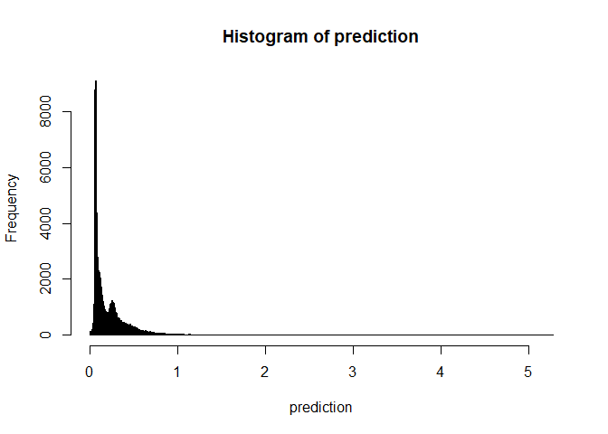

<center>

<h1>

Hertiage Health Prize - A Kaggle Competition

</h1>

</center>

<center>

<h1>

By: Robert Brown

</h1>

</center>

``` r
#password stored in other file
source("D:\\Bdrive\\School\\Dropbox Drop\\MPH\\MPH-Spring_2017\\PH290.9-Big_Data\\PH290.9-Project\\PH290.9-P1\\HHP_release3\\database_pw.R")
```

``` r
#######################################
############ Loading Data #############
#######################################

#list of all csv files in directory
temp = list.files(pattern="*.csv")
#loop through list and assign the name of the file minus "csv" file extension from the name
for (i in 1:length(temp)) assign(sub('\\..*', '', temp[i]), read.csv(temp[i], stringsAsFactors = TRUE))
```

# Data exploration

``` r
############################
##### Data exploration #####
############################

all_dfs <- sapply(sapply(ls(), get), is.data.frame)
all_dfs_list <- names(all_dfs)[(all_dfs==TRUE)] 
```

``` r
#snapshot of each dataset
for (i in all_dfs_list) {
  glimpse(get(i))
}
```

    ## Rows: 2,668,990
    ## Columns: 14
    ## $ MemberID              <int> 42286978, 97903248, 2759427, 73570559, 118370...
    ## $ ProviderID            <int> 8013252, 3316066, 2997752, 7053364, 7557061, ...
    ## $ Vendor                <int> 172193, 726296, 140343, 240043, 496247, 4042,...
    ## $ PCP                   <int> 37796, 5300, 91972, 70119, 68968, 55823, 9197...
    ## $ Year                  <fct> Y1, Y3, Y3, Y3, Y2, Y3, Y1, Y1, Y2, Y3, Y3, Y...
    ## $ Specialty             <fct> Surgery, Internal, Internal, Laboratory, Surg...
    ## $ PlaceSvc              <fct> Office, Office, Office, Independent Lab, Outp...
    ## $ PayDelay              <fct> 28, 50, 14, 24, 27, 25, 162+, 29, 42, 56, 37,...
    ## $ LengthOfStay          <fct> , , , , , , , , , , , , 1 day, , , , , , , , ...
    ## $ DSFS                  <fct> 8- 9 months, 7- 8 months, 0- 1 month, 5- 6 mo...
    ## $ PrimaryConditionGroup <fct> NEUMENT, NEUMENT, METAB3, METAB3, FXDISLC, NE...
    ## $ CharlsonIndex         <fct> 0, 1-2, 0, 1-2, 1-2, 0, 0, 0, 0, 1-2, 1-2, 0,...
    ## $ ProcedureGroup        <fct> MED, EM, EM, SCS, EM, EM, MED, RAD, EM, SCS, ...
    ## $ SupLOS                <int> 0, 0, 0, 0, 0, 0, 0, 0, 0, 0, 0, 0, 0, 0, 0, ...
    ## Rows: 76,038
    ## Columns: 3
    ## $ MemberID        <int> 24027423, 98324177, 33899367, 5481382, 69908334, 29...
    ## $ ClaimsTruncated <int> 0, 0, 1, 0, 0, 0, 0, 0, 0, 0, 0, 0, 0, 0, 0, 1, 0, ...
    ## $ DaysInHospital  <int> 0, 0, 1, 1, 0, 0, 0, 0, 0, 0, 0, 0, 0, 0, 0, 0, 0, ...
    ## Rows: 71,435
    ## Columns: 3
    ## $ MemberID        <int> 90963501, 85160905, 45496648, 45162557, 68793937, 2...
    ## $ ClaimsTruncated <int> 0, 0, 0, 0, 0, 0, 0, 1, 0, 0, 0, 0, 0, 0, 0, 0, 0, ...
    ## $ DaysInHospital  <int> 0, 0, 0, 0, 0, 1, 0, 0, 0, 0, 0, 0, 0, 0, 0, 0, 3, ...
    ## Rows: 818,241
    ## Columns: 4
    ## $ MemberID  <int> 48925661, 90764620, 61221204, 63628544, 46949606, 7211075...
    ## $ Year      <fct> Y2, Y3, Y1, Y3, Y2, Y2, Y2, Y3, Y1, Y3, Y3, Y1, Y1, Y2, Y...
    ## $ DSFS      <fct> 9-10 months, 8- 9 months, 2- 3 months, 1- 2 months, 10-11...
    ## $ DrugCount <fct> 7+, 3, 1, 1, 3, 1, 3, 1, 1, 1, 4, 1, 1, 2, 4, 1, 1, 1, 2,...
    ## Rows: 361,484
    ## Columns: 4
    ## $ MemberID <int> 69258001, 10143167, 1054357, 56583841, 70967047, 88850854,...
    ## $ Year     <fct> Y3, Y1, Y1, Y3, Y2, Y2, Y3, Y3, Y2, Y3, Y3, Y3, Y2, Y2, Y2...
    ## $ DSFS     <fct> 2- 3 months, 0- 1 month, 0- 1 month, 6- 7 months, 0- 1 mon...
    ## $ LabCount <fct> 1, 2, 6, 4, 2, 5, 6, 2, 1, 3, 8, 1, 10+, 7, 6, 1, 3, 1, 6,...
    ## Rows: 113,000
    ## Columns: 3
    ## $ MemberID        <int> 14723353, 75706636, 17320609, 69690888, 33004608, 6...
    ## $ AgeAtFirstClaim <fct> 70-79, 70-79, 70-79, 40-49, 0-9, 40-49, 30-39, 70-7...
    ## $ Sex             <fct> M, M, M, M, M, F, M, F, , M, M, F, M, F, M, F, F, ,...
    ## Rows: 70,942
    ## Columns: 3
    ## $ MemberID        <int> 20820036, 14625274, 99227820, 74486714, 92341995, 7...
    ## $ ClaimsTruncated <int> 0, 1, 0, 0, 0, 0, 1, 0, 0, 0, 0, 0, 0, 0, 0, 0, 0, ...
    ## $ DaysInHospital  <lgl> NA, NA, NA, NA, NA, NA, NA, NA, NA, NA, NA, NA, NA,...
    ## Rows: 55,138
    ## Columns: 77
    ## $ X               <int> 1, 3, 4, 5, 6, 10, 11, 13, 14, 15, 19, 21, 22, 23, ...
    ## $ MemberID        <int> 4, 3197, 3457, 3713, 3741, 5187, 8213, 10242, 11951...
    ## $ AgeAtFirstClaim <fct> 0-9, 0-9, 0-9, 40-49, 70-79, 0-9, 10-19, 20-29, 10-...
    ## $ Sex             <fct> M, F, M, F, F, M, M, F, F, F, F, F, F, M, F, F, F, ...
    ## $ PLSVAmbulance   <int> 0, 0, 0, 0, 0, 0, 0, 0, 0, 0, 0, 0, 0, 0, 0, 0, 0, ...
    ## $ PLSVHome        <int> 0, 0, 0, 0, 0, 0, 0, 0, 0, 0, 0, 0, 0, 0, 0, 0, 0, ...
    ## $ PLSVInH         <int> 0, 0, 0, 0, 0, 0, 0, 3, 0, 0, 0, 0, 0, 0, 0, 0, 0, ...
    ## $ PLSVInLab       <int> 0, 2, 0, 2, 11, 0, 2, 9, 2, 0, 1, 0, 1, 1, 18, 3, 2...
    ## $ PLSVOffice      <int> 1, 3, 1, 8, 9, 2, 0, 2, 4, 0, 7, 2, 11, 5, 3, 11, 3...
    ## $ PLSVOutH        <int> 0, 0, 0, 0, 0, 0, 0, 0, 0, 0, 0, 0, 2, 2, 0, 0, 0, ...
    ## $ PLSVUrgCare     <int> 0, 0, 0, 0, 0, 0, 1, 0, 5, 4, 0, 0, 4, 2, 0, 2, 0, ...
    ## $ PLSVOther       <int> 0, 0, 0, 0, 0, 0, 0, 0, 0, 0, 0, 0, 0, 0, 0, 0, 0, ...
    ## $ SPGAnesth       <int> 0, 0, 0, 0, 0, 0, 0, 0, 0, 0, 0, 0, 0, 0, 0, 0, 0, ...
    ## $ SPGDiagIm       <int> 0, 1, 0, 1, 0, 0, 0, 0, 3, 0, 1, 0, 5, 1, 0, 0, 0, ...
    ## $ SPGEmerg        <int> 0, 0, 0, 0, 0, 0, 0, 1, 3, 4, 1, 0, 0, 1, 1, 1, 0, ...
    ## $ SPGGenPra       <int> 0, 0, 0, 7, 0, 0, 0, 0, 0, 0, 3, 0, 0, 5, 0, 7, 0, ...
    ## $ SPGInt          <int> 0, 1, 0, 0, 7, 0, 1, 2, 1, 0, 2, 0, 5, 2, 2, 5, 0, ...
    ## $ SPGLab          <int> 0, 2, 0, 2, 11, 0, 2, 9, 2, 0, 1, 0, 1, 1, 18, 1, 2...
    ## $ SPGObsGyn       <int> 0, 0, 0, 0, 0, 0, 0, 2, 0, 0, 0, 0, 0, 0, 0, 0, 0, ...
    ## $ SPGPatho        <int> 0, 0, 0, 0, 0, 0, 0, 0, 0, 0, 0, 0, 0, 0, 0, 2, 0, ...
    ## $ SPGPedi         <int> 0, 0, 0, 0, 0, 0, 0, 0, 0, 0, 0, 0, 0, 0, 0, 0, 0, ...
    ## $ SPGSurg         <int> 0, 0, 0, 0, 2, 0, 0, 0, 1, 0, 0, 0, 7, 0, 0, 0, 0, ...
    ## $ SPGOther        <int> 0, 0, 0, 0, 0, 0, 0, 0, 0, 0, 0, 0, 0, 0, 0, 0, 0, ...
    ## $ PCG_AMI         <int> 0, 0, 0, 0, 0, 0, 0, 0, 0, 0, 0, 0, 1, 0, 0, 7, 0, ...
    ## $ PCG_RENAL1      <int> 0, 0, 0, 0, 0, 0, 0, 0, 0, 0, 0, 0, 0, 0, 0, 0, 0, ...
    ## $ PCG_RESPR4      <int> 1, 4, 0, 1, 0, 0, 0, 1, 0, 0, 1, 0, 0, 0, 0, 0, 0, ...
    ## $ PCG_INFEC4      <int> 0, 0, 0, 0, 0, 0, 0, 0, 0, 0, 1, 0, 0, 0, 1, 0, 0, ...
    ## $ PCG_TRAUMA      <int> 0, 0, 0, 0, 0, 0, 0, 0, 1, 0, 0, 0, 1, 0, 0, 1, 0, ...
    ## $ PCG_APPCHOL     <int> 0, 0, 0, 0, 0, 0, 0, 0, 0, 0, 0, 0, 0, 0, 0, 0, 0, ...
    ## $ PCG_ARTHSPIN    <int> 0, 0, 0, 3, 0, 0, 0, 0, 2, 0, 2, 0, 1, 3, 0, 1, 0, ...
    ## $ PCG_HEART4      <int> 0, 0, 0, 0, 0, 0, 0, 0, 0, 0, 0, 0, 0, 0, 0, 0, 0, ...
    ## $ PCG_CANCRA      <int> 0, 0, 0, 0, 0, 0, 0, 0, 0, 0, 0, 0, 0, 0, 0, 0, 0, ...
    ## $ PCG_CANCRB      <int> 0, 0, 0, 0, 0, 0, 0, 0, 0, 0, 2, 0, 0, 0, 0, 0, 0, ...
    ## $ PCG_CATAST      <int> 0, 0, 0, 0, 0, 0, 0, 0, 0, 0, 0, 0, 0, 0, 0, 0, 0, ...
    ## $ PCG_ROAMI       <int> 0, 0, 0, 0, 0, 0, 0, 0, 0, 0, 0, 0, 1, 0, 0, 0, 0, ...
    ## $ PCG_COPD        <int> 0, 0, 0, 0, 0, 0, 0, 0, 0, 0, 0, 0, 0, 0, 0, 1, 0, ...
    ## $ PCG_RENAL2      <int> 0, 0, 0, 0, 0, 0, 0, 0, 0, 0, 0, 0, 0, 0, 0, 0, 0, ...
    ## $ PCG_CHF         <int> 0, 0, 0, 0, 0, 0, 0, 0, 0, 0, 0, 0, 0, 0, 0, 2, 0, ...
    ## $ PCG_METAB1      <int> 0, 0, 0, 0, 0, 0, 0, 0, 0, 0, 0, 0, 0, 0, 0, 0, 0, ...
    ## $ PCG_FLaELEC     <int> 0, 0, 0, 0, 0, 0, 0, 0, 0, 0, 0, 0, 0, 0, 0, 0, 0, ...
    ## $ PCG_FXDISLC     <int> 0, 0, 0, 0, 0, 0, 0, 0, 5, 0, 0, 0, 7, 0, 0, 0, 0, ...
    ## $ PCG_GIBLEED     <int> 0, 0, 0, 0, 0, 0, 0, 0, 0, 0, 0, 0, 0, 0, 0, 0, 0, ...
    ## $ PCG_GIOBSENT    <int> 0, 0, 0, 0, 0, 0, 0, 0, 0, 0, 0, 0, 0, 0, 0, 0, 0, ...
    ## $ PCG_GYNECA      <int> 0, 0, 0, 0, 0, 0, 0, 0, 0, 0, 0, 0, 0, 0, 0, 0, 0, ...
    ## $ PCG_GYNEC1      <int> 0, 0, 0, 0, 0, 0, 0, 0, 0, 0, 0, 0, 0, 0, 0, 0, 0, ...
    ## $ PCG_HIPFX       <int> 0, 0, 0, 0, 0, 0, 0, 0, 0, 0, 0, 0, 0, 0, 0, 0, 0, ...
    ## $ PCG_ODaBNCA     <int> 0, 0, 0, 0, 0, 0, 0, 0, 0, 0, 0, 0, 0, 0, 0, 0, 0, ...
    ## $ PCG_LIVERDZ     <int> 0, 0, 0, 0, 0, 0, 0, 0, 0, 0, 0, 0, 0, 0, 0, 0, 0, ...
    ## $ PCG_MISCL1      <int> 0, 0, 0, 0, 0, 0, 0, 0, 0, 0, 0, 0, 0, 0, 0, 0, 0, ...
    ## $ PCG_MSC2a3      <int> 0, 0, 1, 2, 2, 1, 0, 1, 3, 0, 2, 2, 4, 0, 18, 1, 2,...
    ## $ PCG_MISCL5      <int> 0, 0, 0, 0, 0, 0, 0, 0, 0, 1, 0, 0, 0, 1, 0, 0, 0, ...
    ## $ PCG_MISCHRT     <int> 0, 0, 0, 0, 0, 0, 0, 0, 0, 0, 0, 0, 2, 0, 0, 0, 0, ...
    ## $ PCG_HEMTOL      <int> 0, 0, 0, 0, 0, 0, 0, 0, 0, 0, 0, 0, 0, 0, 0, 0, 2, ...
    ## $ PCG_HEART2      <int> 0, 0, 0, 0, 0, 0, 0, 0, 0, 0, 0, 0, 0, 0, 0, 0, 0, ...
    ## $ PCG_METAB3      <int> 0, 0, 0, 0, 14, 0, 2, 0, 0, 0, 0, 0, 0, 6, 0, 0, 0,...
    ## $ PCG_NEUMENT     <int> 0, 1, 0, 0, 3, 1, 0, 0, 0, 0, 0, 0, 1, 0, 0, 0, 1, ...
    ## $ PCG_RENAL3      <int> 0, 0, 0, 2, 0, 0, 0, 0, 0, 0, 0, 0, 0, 0, 0, 0, 0, ...
    ## $ PCG_CANCRM      <int> 0, 0, 0, 0, 0, 0, 0, 0, 0, 0, 0, 0, 0, 0, 0, 0, 0, ...
    ## $ PCG_PNCRDZ      <int> 0, 0, 0, 0, 0, 0, 0, 0, 0, 0, 0, 0, 0, 0, 0, 0, 0, ...
    ## $ PCG_PERVALV     <int> 0, 0, 0, 0, 0, 0, 0, 0, 0, 0, 0, 0, 0, 0, 0, 0, 0, ...
    ## $ PCG_PERINTL     <int> 0, 0, 0, 0, 0, 0, 0, 0, 0, 0, 0, 0, 0, 0, 0, 0, 0, ...
    ## $ PCG_PNEUM       <int> 0, 0, 0, 0, 0, 0, 0, 0, 0, 0, 0, 0, 0, 0, 0, 0, 0, ...
    ## $ PCG_PRGNCY      <int> 0, 0, 0, 0, 0, 0, 0, 12, 0, 0, 0, 0, 0, 0, 0, 0, 0,...
    ## $ PCG_SEIZURE     <int> 0, 0, 0, 0, 0, 0, 0, 0, 0, 0, 0, 0, 0, 0, 0, 0, 0, ...
    ## $ PCG_SEPSIS      <int> 0, 0, 0, 0, 0, 0, 0, 0, 0, 0, 0, 0, 0, 0, 0, 0, 0, ...
    ## $ PCG_SKNAUT      <int> 0, 0, 0, 0, 1, 0, 1, 0, 0, 0, 0, 0, 0, 0, 0, 1, 0, ...
    ## $ PCG_STROKE      <int> 0, 0, 0, 0, 0, 0, 0, 0, 0, 0, 0, 0, 0, 0, 0, 0, 0, ...
    ## $ PCG_UTI         <int> 0, 0, 0, 2, 0, 0, 0, 0, 0, 3, 0, 0, 0, 0, 2, 0, 0, ...
    ## $ CHARL0          <int> 1, 5, 1, 10, 18, 2, 3, 13, 11, 4, 8, 2, 0, 0, 21, 0...
    ## $ CHARL1to2       <int> 0, 0, 0, 0, 2, 0, 0, 1, 0, 0, 0, 0, 18, 10, 0, 16, ...
    ## $ CHARL3to4       <int> 0, 0, 0, 0, 0, 0, 0, 0, 0, 0, 0, 0, 0, 0, 0, 0, 0, ...
    ## $ CHARL5          <int> 0, 0, 0, 0, 0, 0, 0, 0, 0, 0, 0, 0, 0, 0, 0, 0, 0, ...
    ## $ PayDelay        <int> 0, 0, 0, 0, 0, 0, 0, 69, 62, 0, 0, 0, 0, 0, 0, 0, 0...
    ## $ LengthOfStay    <int> 0, 0, 0, 0, 0, 0, 0, 6, 1, 0, 0, 0, 0, 0, 0, 0, 0, ...
    ## $ DSFS            <int> 0, 0, 0, 0, 0, 0, 0, 150, 15, 0, 0, 0, 0, 0, 0, 0, ...
    ## $ DaysInHospital  <int> 0, 0, 0, 0, 0, 0, 0, 0, 1, 0, 0, 0, 0, 0, 0, 1, 0, ...
    ## $ DaysInHospitalB <int> 0, 0, 0, 0, 0, 0, 0, 0, 1, 0, 0, 0, 0, 0, 0, 1, 0, ...


```{r eval=FALSE}
#dplyr getting bogged down 
claims_per_member_nest <- Claims %>%
  group_by(Year, MemberID) %>%
  summarize(no_Claims = n(), 
            no_Providers = n_distinct(ProviderID),
            # no_Venders = n_distinct(Vendor),
            # no_PCPs = n_distinct(PCP),
            # no_PlaceSvcs = n_distinct(PlaceSvc),
            # no_PrimaryConditionGroups = n_distinct(PrimaryConditionGroup),
             no_ProcedureGroups = n_distinct(ProcedureGroup),
             PayDelay_max = max(PayDelay_int),
            PayDelay_min = min(PayDelay_int),
            PayDelay_ave = mean(PayDelay_int))

```


```{r eval=FALSE}
#Attempting to parallelize across multiple cores
#Creating Summary table member/year

#https://cfss.uchicago.edu/notes/split-apply-combine/

cluster <- new_cluster(detectCores())

claims_per_member_nest <- Claims %>%

  group_by(Year, MemberID) %>%
  partition(cluster = cluster) %>%
  summarize(no_Claims = n(), 
            no_Providers = n_distinct(ProviderID),
            no_Venders = n_distinct(Vendor),
            no_PCPs = n_distinct(PCP),
            no_PlaceSvcs = n_distinct(PlaceSvc),
            no_PrimaryConditionGroups = n_distinct(PrimaryConditionGroup),
            no_ProcedureGroups = n_distinct(ProcedureGroup),
            PayDelay_max = max(PayDelay_int),
            PayDelay_min = min(PayDelay_int),
            PayDelay_ave = mean(PayDelay_int)) %>%
  collect()

```


```{r, eval=FALSE}
#Used the following sql commands to generate postgres database to generate data 

/**************************
load in the raw data
**************************/

--claims
CREATE TABLE Claims
(
MemberID VARCHAR(8) --integers starting with 0, could be text!
, ProviderID VARCHAR(7) --integers starting with 0, could be text!
, Vendor VARCHAR(6) --integers starting with 0, could be text!
, PCP VARCHAR(5) --integers starting with 0, could be text!
, Year VARCHAR(2)
, Specialty VARCHAR(25)
, PlaceSvc VARCHAR(19)
, PayDelay VARCHAR(4)
, LengthOfStay VARCHAR(10)
, DSFS VARCHAR(12)
, PrimaryConditionGroup VARCHAR(8)
, CharlsonIndex VARCHAR(3)
, ProcedureGroup VARCHAR(4)
, SupLOS int
)

COPY Claims FROM 'D:\Bdrive\School\Dropbox Drop\MPH\MPH-Spring_2017\PH290.9-Big_Data\PH290.9-Project\PH290.9-P1\HHP_release3\Claims.csv'
DELIMITER ',' CSV HEADER;

--members
CREATE TABLE Members
(
MemberID_M VARCHAR(8) --integers starting with 0, could be text!
, AgeAtFirstClaim VARCHAR(5)
, Sex VARCHAR(1)
)

COPY Members FROM 'D:\Bdrive\School\Dropbox Drop\MPH\MPH-Spring_2017\PH290.9-Big_Data\PH290.9-Project\PH290.9-P1\HHP_release3\Members.csv'
DELIMITER ',' CSV HEADER;

-- drug count
CREATE TABLE DrugCount
(
MemberID INT
, Year VARCHAR(2)
, DSFS VARCHAR(12)
, DrugCount VARCHAR(2)
)

COPY DrugCount FROM 'D:\Bdrive\School\Dropbox Drop\MPH\MPH-Spring_2017\PH290.9-Big_Data\PH290.9-Project\PH290.9-P1\HHP_release3\DrugCount.csv'
DELIMITER ',' CSV HEADER;


-- Lab Count
CREATE TABLE LabCount
(
MemberID INT
, Year VARCHAR(2)
, DSFS VARCHAR(12)
, LabCount VARCHAR(3)
)

COPY LabCount FROM 'D:\Bdrive\School\Dropbox Drop\MPH\MPH-Spring_2017\PH290.9-Big_Data\PH290.9-Project\PH290.9-P1\HHP_release3\LabCount.csv'
DELIMITER ',' CSV HEADER;


--DaysInHospital_Y2
CREATE TABLE DaysInHospital_Y2
(
MemberID INT
, ClaimsTruncated INT
, DaysInHospital INT
)

COPY DaysInHosptial_Y2 FROM 'D:\Bdrive\School\Dropbox Drop\MPH\MPH-Spring_2017\PH290.9-Big_Data\PH290.9-Project\PH290.9-P1\HHP_release3\DaysInHosptial_Y2.csv'
DELIMITER ',' CSV HEADER;


-- DaysInHospital_Y3
CREATE TABLE DaysInHospital_Y3
(
MemberID INT
, ClaimsTruncated INT
, DaysInHospital INT
)

COPY DaysInHosptial_Y3 FROM 'D:\Bdrive\School\Dropbox Drop\MPH\MPH-Spring_2017\PH290.9-Big_Data\PH290.9-Project\PH290.9-P1\HHP_release3\DaysInHosptial_Y3.csv'
DELIMITER ',' CSV HEADER;


-- Target
CREATE TABLE Target
(
MemberID INT
, ClaimsTruncated INT
, DaysInHospital INT
)

COPY Target FROM 'D:\Bdrive\School\Dropbox Drop\MPH\MPH-Spring_2017\PH290.9-Big_Data\PH290.9-Project\PH290.9-P1\HHP_release3\Target.csv'
DELIMITER ',' CSV HEADER;


/*************************
adjust the claims data converting categorical vars
**************************/

-- PayDelay
ALTER TABLE Claims
ADD PayDelayI integer

UPDATE Claims
SET PayDelayI = CASE WHEN PayDelay = '162+' THEN 162 ELSE CAST(PayDelay AS integer) END


--dsfs
ALTER TABLE Claims
ADD dsfsI integer


UPDATE Claims
SET dsfsI =
CASE
WHEN dsfs = '0- 1 month' THEN 1
WHEN dsfs = '1- 2 months' THEN 2
WHEN dsfs = '2- 3 months' THEN 3
WHEN dsfs = '3- 4 months' THEN 4
WHEN dsfs = '4- 5 months' THEN 5
WHEN dsfs = '5- 6 months' THEN 6
WHEN dsfs = '6- 7 months' THEN 7
WHEN dsfs = '7- 8 months' THEN 8
WHEN dsfs = '8- 9 months' THEN 9
WHEN dsfs = '9-10 months' THEN 10
WHEN dsfs = '10-11 months' THEN 11
WHEN dsfs = '11-12 months' THEN 12
WHEN dsfs IS NULL THEN NULL
END


-- CharlsonIndex
ALTER TABLE Claims
ADD CharlsonIndexI INTEGER

UPDATE Claims
SET CharlsonIndexI =
CASE
WHEN CharlsonIndex = '0' THEN 0
WHEN CharlsonIndex = '1-2' THEN 2
WHEN CharlsonIndex = '3-4' THEN 4
WHEN CharlsonIndex = '5+' THEN 6
END


-- LengthOfStay
ALTER TABLE Claims
ADD LengthOfStayI INTEGER

UPDATE Claims
SET LengthOfStayI =
CASE
WHEN LengthOfStay = '1 day' THEN 1
WHEN LengthOfStay = '2 days' THEN 2
WHEN LengthOfStay = '3 days' THEN 3
WHEN LengthOfStay = '4 days' THEN 4
WHEN LengthOfStay = '5 days' THEN 5
WHEN LengthOfStay = '6 days' THEN 6
WHEN LengthOfStay = '1- 2 weeks' THEN 11
WHEN LengthOfStay = '2- 4 weeks' THEN 21
WHEN LengthOfStay = '4- 8 weeks' THEN 42
WHEN LengthOfStay = '26+ weeks' THEN 180
WHEN LengthOfStay IS NULL THEN null
END


/**************************
creating a summary table
grouped by member/year
***************************/
SELECT
year
,Memberid


,COUNT(*) AS no_Claims
,COUNT(DISTINCT ProviderID) AS no_Providers
,COUNT(DISTINCT Vendor) AS no_Vendors
,COUNT(DISTINCT PCP) AS no_PCPs
,COUNT(DISTINCT PlaceSvc) AS no_PlaceSvcs
,COUNT(DISTINCT Specialty) AS no_Specialities
,COUNT(DISTINCT PrimaryConditionGroup) AS no_PrimaryConditionGroups
,COUNT(DISTINCT ProcedureGroup) AS no_ProcedureGroups


,MAX(PayDelayI) AS PayDelay_max
,MIN(PayDelayI) AS PayDelay_min
,AVG(PayDelayI) AS PayDelay_ave
,(CASE WHEN COUNT(*) = 1 THEN 0 ELSE STDDEV(PayDelayI) END) AS PayDelay_stdev


,MAX(LengthOfStayI) AS LOS_max
,MIN(LengthOfStayI) AS LOS_min
,AVG(LengthOfStayI) AS LOS_ave
,(CASE WHEN COUNT(*) = 1 THEN 0 ELSE STDDEV(LengthOfStayI) END) AS LOS_stdev


,SUM(CASE WHEN LENGTHOFSTAY IS NULL AND SUPLOS = 0 THEN 1 ELSE 0 END) AS LOS_TOT_UNKNOWN
,SUM(CASE WHEN LENGTHOFSTAY IS NULL AND SUPLOS = 1 THEN 1 ELSE 0 END) AS LOS_TOT_SUPRESSED
,SUM(CASE WHEN LENGTHOFSTAY IS NOT NULL THEN 1 ELSE 0 END) AS LOS_TOT_KNOWN


,MAX(dsfsI) AS dsfs_max
,MIN(dsfsI) AS dsfs_min
,MAX(dsfsI) - MIN(dsfsI) AS dsfs_range
,AVG(dsfsI) AS dsfs_ave
,(CASE WHEN COUNT(*) = 1 THEN 0 ELSE STDDEV(dsfsI) END) AS dsfs_stdev


,MAX(CharlsonIndexI) AS CharlsonIndexI_max
,MIN(CharlsonIndexI) AS CharlsonIndexI_min
,AVG(CharlsonIndexI) AS CharlsonIndexI_ave
,MAX(CharlsonIndexI) - MIN(CharlsonIndexI) AS CharlsonIndexI_range
,(CASE WHEN COUNT(*) = 1 THEN 0 ELSE STDDEV(CharlsonIndexI) END) AS CharlsonIndexI_stdev


,SUM(CASE WHEN PrimaryConditionGroup = 'MSC2a3' THEN 1 ELSE 0 END) AS pcg1
,SUM(CASE WHEN PrimaryConditionGroup = 'METAB3' THEN 1 ELSE 0 END) AS pcg2
,SUM(CASE WHEN PrimaryConditionGroup = 'ARTHSPIN' THEN 1 ELSE 0 END) AS pcg3
,SUM(CASE WHEN PrimaryConditionGroup = 'NEUMENT' THEN 1 ELSE 0 END) AS pcg4
,SUM(CASE WHEN PrimaryConditionGroup = 'RESPR4' THEN 1 ELSE 0 END) AS pcg5
,SUM(CASE WHEN PrimaryConditionGroup = 'MISCHRT' THEN 1 ELSE 0 END) AS pcg6
,SUM(CASE WHEN PrimaryConditionGroup = 'SKNAUT' THEN 1 ELSE 0 END) AS pcg7
,SUM(CASE WHEN PrimaryConditionGroup = 'GIBLEED' THEN 1 ELSE 0 END) AS pcg8
,SUM(CASE WHEN PrimaryConditionGroup = 'INFEC4' THEN 1 ELSE 0 END) AS pcg9
,SUM(CASE WHEN PrimaryConditionGroup = 'TRAUMA' THEN 1 ELSE 0 END) AS pcg10
,SUM(CASE WHEN PrimaryConditionGroup = 'HEART2' THEN 1 ELSE 0 END) AS pcg11
,SUM(CASE WHEN PrimaryConditionGroup = 'RENAL3' THEN 1 ELSE 0 END) AS pcg12
,SUM(CASE WHEN PrimaryConditionGroup = 'ROAMI' THEN 1 ELSE 0 END) AS pcg13
,SUM(CASE WHEN PrimaryConditionGroup = 'MISCL5' THEN 1 ELSE 0 END) AS pcg14
,SUM(CASE WHEN PrimaryConditionGroup = 'ODaBNCA' THEN 1 ELSE 0 END) AS pcg15
,SUM(CASE WHEN PrimaryConditionGroup = 'UTI' THEN 1 ELSE 0 END) AS pcg16
,SUM(CASE WHEN PrimaryConditionGroup = 'COPD' THEN 1 ELSE 0 END) AS pcg17
,SUM(CASE WHEN PrimaryConditionGroup = 'GYNEC1' THEN 1 ELSE 0 END) AS pcg18
,SUM(CASE WHEN PrimaryConditionGroup = 'CANCRB' THEN 1 ELSE 0 END) AS pcg19
,SUM(CASE WHEN PrimaryConditionGroup = 'FXDISLC' THEN 1 ELSE 0 END) AS pcg20
,SUM(CASE WHEN PrimaryConditionGroup = 'AMI' THEN 1 ELSE 0 END) AS pcg21
,SUM(CASE WHEN PrimaryConditionGroup = 'PRGNCY' THEN 1 ELSE 0 END) AS pcg22
,SUM(CASE WHEN PrimaryConditionGroup = 'HEMTOL' THEN 1 ELSE 0 END) AS pcg23
,SUM(CASE WHEN PrimaryConditionGroup = 'HEART4' THEN 1 ELSE 0 END) AS pcg24
,SUM(CASE WHEN PrimaryConditionGroup = 'SEIZURE' THEN 1 ELSE 0 END) AS pcg25
,SUM(CASE WHEN PrimaryConditionGroup = 'APPCHOL' THEN 1 ELSE 0 END) AS pcg26
,SUM(CASE WHEN PrimaryConditionGroup = 'CHF' THEN 1 ELSE 0 END) AS pcg27
,SUM(CASE WHEN PrimaryConditionGroup = 'GYNECA' THEN 1 ELSE 0 END) AS pcg28
,SUM(CASE WHEN PrimaryConditionGroup IS NULL THEN 1 ELSE 0 END) AS pcg29
,SUM(CASE WHEN PrimaryConditionGroup = 'PNEUM' THEN 1 ELSE 0 END) AS pcg30
,SUM(CASE WHEN PrimaryConditionGroup = 'RENAL2' THEN 1 ELSE 0 END) AS pcg31
,SUM(CASE WHEN PrimaryConditionGroup = 'GIOBSENT' THEN 1 ELSE 0 END) AS pcg32
,SUM(CASE WHEN PrimaryConditionGroup = 'STROKE' THEN 1 ELSE 0 END) AS pcg33
,SUM(CASE WHEN PrimaryConditionGroup = 'CANCRA' THEN 1 ELSE 0 END) AS pcg34
,SUM(CASE WHEN PrimaryConditionGroup = 'FLaELEC' THEN 1 ELSE 0 END) AS pcg35
,SUM(CASE WHEN PrimaryConditionGroup = 'MISCL1' THEN 1 ELSE 0 END) AS pcg36
,SUM(CASE WHEN PrimaryConditionGroup = 'HIPFX' THEN 1 ELSE 0 END) AS pcg37
,SUM(CASE WHEN PrimaryConditionGroup = 'METAB1' THEN 1 ELSE 0 END) AS pcg38
,SUM(CASE WHEN PrimaryConditionGroup = 'PERVALV' THEN 1 ELSE 0 END) AS pcg39
,SUM(CASE WHEN PrimaryConditionGroup = 'LIVERDZ' THEN 1 ELSE 0 END) AS pcg40
,SUM(CASE WHEN PrimaryConditionGroup = 'CATAST' THEN 1 ELSE 0 END) AS pcg41
,SUM(CASE WHEN PrimaryConditionGroup = 'CANCRM' THEN 1 ELSE 0 END) AS pcg42
,SUM(CASE WHEN PrimaryConditionGroup = 'PERINTL' THEN 1 ELSE 0 END) AS pcg43
,SUM(CASE WHEN PrimaryConditionGroup = 'PNCRDZ' THEN 1 ELSE 0 END) AS pcg44
,SUM(CASE WHEN PrimaryConditionGroup = 'RENAL1' THEN 1 ELSE 0 END) AS pcg45
,SUM(CASE WHEN PrimaryConditionGroup = 'SEPSIS' THEN 1 ELSE 0 END) AS pcg46


,SUM(CASE WHEN Specialty = 'Internal' THEN 1 ELSE 0 END) AS sp1
,SUM(CASE WHEN Specialty = 'Laboratory' THEN 1 ELSE 0 END) AS sp2
,SUM(CASE WHEN Specialty = 'General Practice' THEN 1 ELSE 0 END) AS sp3
,SUM(CASE WHEN Specialty = 'Surgery' THEN 1 ELSE 0 END) AS sp4
,SUM(CASE WHEN Specialty = 'Diagnostic Imaging' THEN 1 ELSE 0 END) AS sp5
,SUM(CASE WHEN Specialty = 'Emergency' THEN 1 ELSE 0 END) AS sp6
,SUM(CASE WHEN Specialty = 'Other' THEN 1 ELSE 0 END) AS sp7
,SUM(CASE WHEN Specialty = 'Pediatrics' THEN 1 ELSE 0 END) AS sp8
,SUM(CASE WHEN Specialty = 'Rehabilitation' THEN 1 ELSE 0 END) AS sp9
,SUM(CASE WHEN Specialty = 'Obstetrics and Gynecology' THEN 1 ELSE 0 END) AS sp10
,SUM(CASE WHEN Specialty = 'Anesthesiology' THEN 1 ELSE 0 END) AS sp11
,SUM(CASE WHEN Specialty = 'Pathology' THEN 1 ELSE 0 END) AS sp12
,SUM(CASE WHEN Specialty IS NULL THEN 1 ELSE 0 END) AS sp13


,SUM(CASE WHEN ProcedureGroup = 'EM' THEN 1 ELSE 0 END ) AS pg1
,SUM(CASE WHEN ProcedureGroup = 'PL' THEN 1 ELSE 0 END ) AS pg2
,SUM(CASE WHEN ProcedureGroup = 'MED' THEN 1 ELSE 0 END ) AS pg3
,SUM(CASE WHEN ProcedureGroup = 'SCS' THEN 1 ELSE 0 END ) AS pg4
,SUM(CASE WHEN ProcedureGroup = 'RAD' THEN 1 ELSE 0 END ) AS pg5
,SUM(CASE WHEN ProcedureGroup = 'SDS' THEN 1 ELSE 0 END ) AS pg6
,SUM(CASE WHEN ProcedureGroup = 'SIS' THEN 1 ELSE 0 END ) AS pg7
,SUM(CASE WHEN ProcedureGroup = 'SMS' THEN 1 ELSE 0 END ) AS pg8
,SUM(CASE WHEN ProcedureGroup = 'ANES' THEN 1 ELSE 0 END ) AS pg9
,SUM(CASE WHEN ProcedureGroup = 'SGS' THEN 1 ELSE 0 END ) AS pg10
,SUM(CASE WHEN ProcedureGroup = 'SEOA' THEN 1 ELSE 0 END ) AS pg11
,SUM(CASE WHEN ProcedureGroup = 'SRS' THEN 1 ELSE 0 END ) AS pg12
,SUM(CASE WHEN ProcedureGroup = 'SNS' THEN 1 ELSE 0 END ) AS pg13
,SUM(CASE WHEN ProcedureGroup = 'SAS' THEN 1 ELSE 0 END ) AS pg14
,SUM(CASE WHEN ProcedureGroup = 'SUS' THEN 1 ELSE 0 END ) AS pg15
,SUM(CASE WHEN ProcedureGroup IS NULL THEN 1 ELSE 0 END ) AS pg16
,SUM(CASE WHEN ProcedureGroup = 'SMCD' THEN 1 ELSE 0 END ) AS pg17
,SUM(CASE WHEN ProcedureGroup = 'SO' THEN 1 ELSE 0 END ) AS pg18


,SUM(CASE WHEN PlaceSvc = 'Office' THEN 1 ELSE 0 END) AS ps1
,SUM(CASE WHEN PlaceSvc = 'Independent Lab' THEN 1 ELSE 0 END) AS ps2
,SUM(CASE WHEN PlaceSvc = 'Urgent Care' THEN 1 ELSE 0 END) AS ps3
,SUM(CASE WHEN PlaceSvc = 'Outpatient Hospital' THEN 1 ELSE 0 END) AS ps4
,SUM(CASE WHEN PlaceSvc = 'Inpatient Hospital' THEN 1 ELSE 0 END) AS ps5
,SUM(CASE WHEN PlaceSvc = 'Ambulance' THEN 1 ELSE 0 END) AS ps6
,SUM(CASE WHEN PlaceSvc = 'Other' THEN 1 ELSE 0 END) AS ps7
,SUM(CASE WHEN PlaceSvc = 'Home' THEN 1 ELSE 0 END) AS ps8
,SUM(CASE WHEN PlaceSvc IS NULL THEN 1 ELSE 0 END) AS ps9


INTO claims_per_member
FROM Claims
GROUP BY year,Memberid


-- remove some nulls
UPDATE claims_per_member
SET LOS_max = 0 WHERE LOS_max IS NULL


UPDATE claims_per_member
SET LOS_min = 0 WHERE LOS_min IS NULL


UPDATE claims_per_member
SET LOS_ave = 0 WHERE LOS_ave IS NULL


UPDATE claims_per_member
SET LOS_stdev = -1 WHERE LOS_stdev IS NULL


UPDATE claims_per_member
SET dsfs_max = 0 WHERE dsfs_max IS NULL


UPDATE claims_per_member
SET dsfs_min = 0 WHERE dsfs_min IS NULL


UPDATE claims_per_member
SET dsfs_ave = 0 WHERE dsfs_ave IS NULL


UPDATE claims_per_member
SET dsfs_stdev = -1 WHERE dsfs_stdev IS NULL


UPDATE claims_per_member
SET dsfs_range = -1 WHERE dsfs_range IS NULL


UPDATE claims_per_member
SET CharlsonIndexI_range = -1 WHERE CharlsonIndexI_range IS NULL


/***********************************
Members
***********************************/


-- creating binary indicator for age
ALTER TABLE Members ADD age_05 INT
ALTER TABLE Members ADD age_15 INT
ALTER TABLE Members ADD age_25 INT
ALTER TABLE Members ADD age_35 INT
ALTER TABLE Members ADD age_45 INT
ALTER TABLE Members ADD age_55 INT
ALTER TABLE Members ADD age_65 INT
ALTER TABLE Members ADD age_75 INT
ALTER TABLE Members ADD age_85 INT
ALTER TABLE Members ADD age_MISS INT


UPDATE Members SET age_05 = CASE WHEN ageATfirstclaim = '0-9' THEN 1 ELSE 0 END
UPDATE Members SET age_15 = CASE WHEN ageATfirstclaim = '10-19' THEN 1 ELSE 0 END
UPDATE Members SET age_25 = CASE WHEN ageATfirstclaim = '20-29' THEN 1 ELSE 0 END
UPDATE Members SET age_35 = CASE WHEN ageATfirstclaim = '30-39' THEN 1 ELSE 0 END
UPDATE Members SET age_45 = CASE WHEN ageATfirstclaim = '40-49' THEN 1 ELSE 0 END
UPDATE Members SET age_55 = CASE WHEN ageATfirstclaim = '50-59' THEN 1 ELSE 0 END
UPDATE Members SET age_65 = CASE WHEN ageATfirstclaim = '60-69' THEN 1 ELSE 0 END
UPDATE Members SET age_75 = CASE WHEN ageATfirstclaim = '70-79' THEN 1 ELSE 0 END
UPDATE Members SET age_85 = CASE WHEN ageATfirstclaim = '80+' THEN 1 ELSE 0 END
UPDATE Members SET age_MISS = CASE WHEN ageATfirstclaim IS NULL THEN 1 ELSE 0 END


--create binary flags for sex
ALTER TABLE Members
ADD sexMALE INT

UPDATE Members
SET SexMALE =
CASE
WHEN Sex = 'M' THEN 1 ELSE 0
END


ALTER TABLE Members
ADD sexFEMALE INT

UPDATE Members
SET SexFEMALE =
CASE
WHEN Sex = 'F' THEN 1 ELSE 0
END


ALTER TABLE Members
ADD sexMISS INT

UPDATE Members
SET SexMISS =
CASE
WHEN Sex IS NULL THEN 1 ELSE 0
END


/******************
DRUG COUNTS
******************/


-- convert to integers
ALTER TABLE drugcount ADD DrugCountI INT
GO
UPDATE DRUGCOUNT
SET DrugCountI =
CASE WHEN DrugCount = '7+' THEN 7 ELSE CAST(DrugCount AS integer) END


SELECT
memberID AS memberID_dc
,Year AS YEAR_dc
,MAX(drugcountI) AS drugCount_max
,MIN(drugcountI) AS drugCount_min
,AVG(drugcountI * 1.0) AS drugCount_ave
,COUNT(*) AS drugcount_months
INTO DRUGCOUNT_SUMMARY
FROM
drugcount
GROUP BY
memberID
,Year


/******************
LAB COUNTS
******************/


-- convert to integers
ALTER TABLE LabCount ADD LabCountI INT

UPDATE LabCount
SET LabCountI =
CASE WHEN LabCount = '10+' THEN 10 ELSE CAST(LabCount AS integer) END


SELECT
memberID AS memberID_lc
,Year AS YEAR_lc
,MAX(labcountI) AS labCount_max
,MIN(labcountI) AS labCount_min
,AVG(labcountI * 1.0) AS labCount_ave
,COUNT(*) AS labcount_months
INTO LABCOUNT_SUMMARY
FROM
labcount
GROUP BY
memberID
,Year


/********************************
Targets
********************************/


SELECT *
INTO DIH
FROM
(
SELECT
MemberID AS MemberID_t
,'Y1' AS YEAR_t
,ClaimsTruncated
,DaysInHospital
,1 AS trainset
FROM DaysInHospital_Y2


UNION ALL


SELECT
MemberID AS MemberID_t
,'Y2' AS YEAR_t
,ClaimsTruncated
,DaysInHospital
,1 AS trainset
FROM DaysInHospital_Y3


UNION ALL


SELECT
MemberID AS MemberID_t
,'Y3' AS YEAR_t
,ClaimsTruncated
,null AS DaysInHospital
,0 AS trainset
FROM Target
) a


/*****************************
Now merge them all together to create the modeling data SET
******************************/
CREATE TEMP TABLE temp1 AS 
SELECT a.*,b.*
FROM
DIH a
LEFT OUTER JOIN
members b
on a.MemberID_t = CAST(B.Memberid_M AS integer)

ALTER TABLE temp1 DROP COLUMN Memberid_M
ALTER TABLE temp1 DROP COLUMN AgeAtFirstClaim
ALTER TABLE temp1 DROP COLUMN Sex


CREATE TEMP TABLE temp2 AS 
SELECT a.*,b.*
FROM temp1 a
LEFT OUTER JOIN
claims_per_member b
on a.MemberID_t = B.Memberid
AND a.YEAR_t = b.year


ALTER TABLE temp2 DROP COLUMN Memberid
ALTER TABLE temp2 DROP COLUMN year


CREATE TEMP TABLE temp3 AS 
SELECT a.*,b.*
FROM temp2 a
LEFT OUTER JOIN
DRUGCOUNT_SUMMARY b
on a.MemberID_t = B.Memberid_dc
AND a.YEAR_t = b.YEAR_dc


ALTER TABLE temp3 DROP COLUMN Memberid_dc
ALTER TABLE temp3 DROP COLUMN YEAR_dc


CREATE TEMP TABLE temp4 AS 
SELECT a.*,b.*
FROM temp3 a
LEFT OUTER JOIN
LABCOUNT_SUMMARY b
on a.MemberID_t = B.Memberid_lc
AND a.YEAR_t = b.YEAR_lc


ALTER TABLE temp4 DROP COLUMN Memberid_lc
ALTER TABLE temp4 DROP COLUMN YEAR_lc
GO


-- removel nulls for those who had
-- no lab or drug information
ALTER TABLE temp4 ADD labNull INT
ALTER TABLE temp4 ADD drugNull INT
GO


UPDATE temp4 SET labNull = 0
UPDATE temp4 SET labNull = 1 WHERE labCount_max IS NULL


UPDATE temp4 SET drugNull = 0
UPDATE temp4 SET drugNull = 1 WHERE drugCount_max IS NULL


UPDATE temp4 SET labCount_max = 0 WHERE labCount_max IS NULL
UPDATE temp4 SET labCount_min = 0 WHERE labCount_min IS NULL
UPDATE temp4 SET labCount_ave = 0 WHERE labCount_ave IS NULL
UPDATE temp4 SET labcount_months = 0 WHERE labcount_months IS NULL


UPDATE temp4 SET drugCount_max = 0 WHERE drugCount_max IS NULL
UPDATE temp4 SET drugCount_min = 0 WHERE drugCount_min IS NULL
UPDATE temp4 SET drugCount_ave = 0 WHERE drugCount_ave IS NULL
UPDATE temp4 SET drugcount_months = 0 WHERE drugcount_months IS NULL


SELECT *
INTO modelling_set
FROM temp4


```


``` r
########################################
#loading the SQL the data
########################################

#set a connection to the database 

m <- dbDriver("PostgreSQL")
con <- dbConnect(m, host = "localhost", user= "postgres", password=database_pw, 
dbname = "HHP_comp")

alldata <- dbGetQuery(con,"select * from modelling_set")
```

# Gradient Boost Machine Algorithm

  - Gradient boost regression - essentially taking small steps in the
    right direction to lead to a prediction (so trying to lower
    variance)
    
      - starts by averaging the the values and then calculates the
        residuals. Then it uses the other variables to predict the
        residuals of the observed and actual value. Then additively
        keeps changing the predicted residuals until the maximum trees
        are reached or additional tree’s don’t reduce the residuals.
    
      - builds fixed tree based off of the previous tree’s errors, and
        scales trees all by the same amount and iterates by building
        tree’s based off the error of the previous tree.
    
      - parameters
        
          - `Shrinkage` - learning rate. Which scales the learning rate
            of each tree.
        
          - `NTrees` - how many trees to fit.
        
          - `Minobs` - minimum number of observations in the terminal
            nodes of the trees
        
          - `Depth` - max depth of trees to fit.

<!-- end list -->

``` r

#identify train and leaderboard data
trainrows <- which(alldata$trainset == 1)
scorerows <- which(alldata$trainset == 0)

#sanity check - checking var names and length
glimpse(alldata)
```

    ## Rows: 218,415
    ## Columns: 143
    ## $ memberid_t                <int> 33803, 170482, 469513, 741234, 1173006, 1...
    ## $ year_t                    <chr> "Y3", "Y3", "Y2", "Y1", "Y1", "Y2", "Y1",...
    ## $ claimstruncated           <int> 0, 0, 0, 0, 0, 0, 0, 0, 0, 0, 0, 0, 0, 0,...
    ## $ daysinhospital            <int> NA, NA, 0, 0, 0, 0, 0, 0, NA, 0, NA, 0, N...
    ## $ trainset                  <int> 0, 0, 1, 1, 1, 1, 1, 1, 0, 1, 0, 1, 0, 1,...
    ## $ age_05                    <int> 0, 0, 1, 0, 0, 0, 0, 0, 0, 0, 0, 0, 0, 0,...
    ## $ age_15                    <int> 1, 0, 0, 0, 1, 0, 0, 1, 0, 0, 1, 1, 0, 0,...
    ## $ age_25                    <int> 0, 0, 0, 0, 0, 0, 1, 0, 0, 1, 0, 0, 1, 0,...
    ## $ age_35                    <int> 0, 1, 0, 0, 0, 0, 0, 0, 0, 0, 0, 0, 0, 0,...
    ## $ age_45                    <int> 0, 0, 0, 1, 0, 0, 0, 0, 0, 0, 0, 0, 0, 0,...
    ## $ age_55                    <int> 0, 0, 0, 0, 0, 1, 0, 0, 1, 0, 0, 0, 0, 0,...
    ## $ age_65                    <int> 0, 0, 0, 0, 0, 0, 0, 0, 0, 0, 0, 0, 0, 1,...
    ## $ age_75                    <int> 0, 0, 0, 0, 0, 0, 0, 0, 0, 0, 0, 0, 0, 0,...
    ## $ age_85                    <int> 0, 0, 0, 0, 0, 0, 0, 0, 0, 0, 0, 0, 0, 0,...
    ## $ age_miss                  <int> 0, 0, 0, 0, 0, 0, 0, 0, 0, 0, 0, 0, 0, 0,...
    ## $ sexmale                   <int> 1, 0, 0, 0, 0, 1, 0, 1, 0, 0, 1, 1, 0, 0,...
    ## $ sexfemale                 <int> 0, 1, 1, 1, 1, 0, 1, 0, 1, 1, 0, 0, 0, 1,...
    ## $ sexmiss                   <int> 0, 0, 0, 0, 0, 0, 0, 0, 0, 0, 0, 0, 1, 0,...
    ## $ no_claims                 <dbl> 1, 1, 2, 2, 1, 1, 2, 2, 3, 2, 1, 2, 8, 1,...
    ## $ no_providers              <dbl> 1, 1, 2, 1, 1, 1, 2, 1, 2, 1, 1, 1, 2, 1,...
    ## $ no_vendors                <dbl> 1, 1, 2, 1, 1, 1, 2, 1, 2, 1, 1, 1, 2, 1,...
    ## $ no_pcps                   <dbl> 1, 1, 1, 1, 1, 1, 1, 1, 1, 1, 1, 1, 1, 1,...
    ## $ no_placesvcs              <dbl> 1, 1, 2, 1, 1, 1, 1, 1, 2, 1, 1, 1, 1, 1,...
    ## $ no_specialities           <dbl> 1, 1, 2, 1, 1, 1, 2, 1, 2, 1, 1, 1, 2, 1,...
    ## $ no_primaryconditiongroups <dbl> 1, 1, 1, 2, 1, 1, 1, 1, 1, 1, 1, 1, 1, 1,...
    ## $ no_proceduregroups        <dbl> 1, 1, 1, 1, 1, 1, 1, 2, 2, 2, 1, 2, 2, 1,...
    ## $ paydelay_max              <int> 37, 13, 49, 101, 39, 11, 135, 52, 30, 36,...
    ## $ paydelay_min              <int> 37, 13, 44, 65, 39, 11, 29, 52, 30, 36, 6...
    ## $ paydelay_ave              <dbl> 37.00, 13.00, 46.50, 83.00, 39.00, 11.00,...
    ## $ paydelay_stdev            <dbl> 0.000000, 0.000000, 3.535534, 25.455844, ...
    ## $ los_max                   <int> 0, 0, 0, 0, 0, 0, 0, 0, 0, 0, 0, 0, 0, 0,...
    ## $ los_min                   <int> 0, 0, 0, 0, 0, 0, 0, 0, 0, 0, 0, 0, 0, 0,...
    ## $ los_ave                   <dbl> 0, 0, 0, 0, 0, 0, 0, 0, 0, 0, 0, 0, 0, 0,...
    ## $ los_stdev                 <dbl> 0, 0, -1, -1, 0, 0, -1, -1, -1, -1, 0, -1...
    ## $ los_tot_unknown           <dbl> 1, 1, 2, 2, 1, 1, 2, 2, 3, 2, 1, 2, 8, 1,...
    ## $ los_tot_supressed         <dbl> 0, 0, 0, 0, 0, 0, 0, 0, 0, 0, 0, 0, 0, 0,...
    ## $ los_tot_known             <dbl> 0, 0, 0, 0, 0, 0, 0, 0, 0, 0, 0, 0, 0, 0,...
    ## $ dsfs_max                  <int> 1, 1, 1, 1, 1, 1, 1, 1, 1, 1, 1, 1, 1, 1,...
    ## $ dsfs_min                  <int> 1, 1, 1, 1, 1, 1, 1, 1, 1, 1, 1, 1, 1, 1,...
    ## $ dsfs_range                <int> 0, 0, 0, 0, 0, 0, 0, 0, 0, 0, 0, 0, 0, 0,...
    ## $ dsfs_ave                  <dbl> 1, 1, 1, 1, 1, 1, 1, 1, 1, 1, 1, 1, 1, 1,...
    ## $ dsfs_stdev                <dbl> 0, 0, 0, 0, 0, 0, 0, 0, 0, 0, 0, 0, 0, 0,...
    ## $ charlsonindexi_max        <int> 0, 0, 0, 0, 0, 0, 0, 0, 0, 0, 0, 0, 0, 0,...
    ## $ charlsonindexi_min        <int> 0, 0, 0, 0, 0, 0, 0, 0, 0, 0, 0, 0, 0, 0,...
    ## $ charlsonindexi_ave        <dbl> 0, 0, 0, 0, 0, 0, 0, 0, 0, 0, 0, 0, 0, 0,...
    ## $ charlsonindexi_range      <int> 0, 0, 0, 0, 0, 0, 0, 0, 0, 0, 0, 0, 0, 0,...
    ## $ charlsonindexi_stdev      <dbl> 0, 0, 0, 0, 0, 0, 0, 0, 0, 0, 0, 0, 0, 0,...
    ## $ pcg1                      <dbl> 0, 0, 0, 0, 0, 0, 0, 2, 3, 0, 0, 0, 0, 0,...
    ## $ pcg2                      <dbl> 0, 0, 0, 0, 0, 0, 0, 0, 0, 2, 0, 0, 0, 1,...
    ## $ pcg3                      <dbl> 0, 0, 0, 0, 0, 0, 0, 0, 0, 0, 0, 0, 0, 0,...
    ## $ pcg4                      <dbl> 0, 0, 0, 0, 0, 0, 0, 0, 0, 0, 0, 0, 8, 0,...
    ## $ pcg5                      <dbl> 0, 0, 0, 0, 1, 0, 0, 0, 0, 0, 0, 0, 0, 0,...
    ## $ pcg6                      <dbl> 0, 0, 0, 1, 0, 0, 0, 0, 0, 0, 0, 0, 0, 0,...
    ## $ pcg7                      <dbl> 0, 0, 0, 0, 0, 0, 2, 0, 0, 0, 1, 0, 0, 0,...
    ## $ pcg8                      <dbl> 0, 0, 0, 0, 0, 1, 0, 0, 0, 0, 0, 0, 0, 0,...
    ## $ pcg9                      <dbl> 0, 0, 2, 0, 0, 0, 0, 0, 0, 0, 0, 2, 0, 0,...
    ## $ pcg10                     <dbl> 1, 1, 0, 0, 0, 0, 0, 0, 0, 0, 0, 0, 0, 0,...
    ## $ pcg11                     <dbl> 0, 0, 0, 0, 0, 0, 0, 0, 0, 0, 0, 0, 0, 0,...
    ## $ pcg12                     <dbl> 0, 0, 0, 0, 0, 0, 0, 0, 0, 0, 0, 0, 0, 0,...
    ## $ pcg13                     <dbl> 0, 0, 0, 0, 0, 0, 0, 0, 0, 0, 0, 0, 0, 0,...
    ## $ pcg14                     <dbl> 0, 0, 0, 1, 0, 0, 0, 0, 0, 0, 0, 0, 0, 0,...
    ## $ pcg15                     <dbl> 0, 0, 0, 0, 0, 0, 0, 0, 0, 0, 0, 0, 0, 0,...
    ## $ pcg16                     <dbl> 0, 0, 0, 0, 0, 0, 0, 0, 0, 0, 0, 0, 0, 0,...
    ## $ pcg17                     <dbl> 0, 0, 0, 0, 0, 0, 0, 0, 0, 0, 0, 0, 0, 0,...
    ## $ pcg18                     <dbl> 0, 0, 0, 0, 0, 0, 0, 0, 0, 0, 0, 0, 0, 0,...
    ## $ pcg19                     <dbl> 0, 0, 0, 0, 0, 0, 0, 0, 0, 0, 0, 0, 0, 0,...
    ## $ pcg20                     <dbl> 0, 0, 0, 0, 0, 0, 0, 0, 0, 0, 0, 0, 0, 0,...
    ## $ pcg21                     <dbl> 0, 0, 0, 0, 0, 0, 0, 0, 0, 0, 0, 0, 0, 0,...
    ## $ pcg22                     <dbl> 0, 0, 0, 0, 0, 0, 0, 0, 0, 0, 0, 0, 0, 0,...
    ## $ pcg23                     <dbl> 0, 0, 0, 0, 0, 0, 0, 0, 0, 0, 0, 0, 0, 0,...
    ## $ pcg24                     <dbl> 0, 0, 0, 0, 0, 0, 0, 0, 0, 0, 0, 0, 0, 0,...
    ## $ pcg25                     <dbl> 0, 0, 0, 0, 0, 0, 0, 0, 0, 0, 0, 0, 0, 0,...
    ## $ pcg26                     <dbl> 0, 0, 0, 0, 0, 0, 0, 0, 0, 0, 0, 0, 0, 0,...
    ## $ pcg27                     <dbl> 0, 0, 0, 0, 0, 0, 0, 0, 0, 0, 0, 0, 0, 0,...
    ## $ pcg28                     <dbl> 0, 0, 0, 0, 0, 0, 0, 0, 0, 0, 0, 0, 0, 0,...
    ## $ pcg29                     <dbl> 0, 0, 0, 0, 0, 0, 0, 0, 0, 0, 0, 0, 0, 0,...
    ## $ pcg30                     <dbl> 0, 0, 0, 0, 0, 0, 0, 0, 0, 0, 0, 0, 0, 0,...
    ## $ pcg31                     <dbl> 0, 0, 0, 0, 0, 0, 0, 0, 0, 0, 0, 0, 0, 0,...
    ## $ pcg32                     <dbl> 0, 0, 0, 0, 0, 0, 0, 0, 0, 0, 0, 0, 0, 0,...
    ## $ pcg33                     <dbl> 0, 0, 0, 0, 0, 0, 0, 0, 0, 0, 0, 0, 0, 0,...
    ## $ pcg34                     <dbl> 0, 0, 0, 0, 0, 0, 0, 0, 0, 0, 0, 0, 0, 0,...
    ## $ pcg35                     <dbl> 0, 0, 0, 0, 0, 0, 0, 0, 0, 0, 0, 0, 0, 0,...
    ## $ pcg36                     <dbl> 0, 0, 0, 0, 0, 0, 0, 0, 0, 0, 0, 0, 0, 0,...
    ## $ pcg37                     <dbl> 0, 0, 0, 0, 0, 0, 0, 0, 0, 0, 0, 0, 0, 0,...
    ## $ pcg38                     <dbl> 0, 0, 0, 0, 0, 0, 0, 0, 0, 0, 0, 0, 0, 0,...
    ## $ pcg39                     <dbl> 0, 0, 0, 0, 0, 0, 0, 0, 0, 0, 0, 0, 0, 0,...
    ## $ pcg40                     <dbl> 0, 0, 0, 0, 0, 0, 0, 0, 0, 0, 0, 0, 0, 0,...
    ## $ pcg41                     <dbl> 0, 0, 0, 0, 0, 0, 0, 0, 0, 0, 0, 0, 0, 0,...
    ## $ pcg42                     <dbl> 0, 0, 0, 0, 0, 0, 0, 0, 0, 0, 0, 0, 0, 0,...
    ## $ pcg43                     <dbl> 0, 0, 0, 0, 0, 0, 0, 0, 0, 0, 0, 0, 0, 0,...
    ## $ pcg44                     <dbl> 0, 0, 0, 0, 0, 0, 0, 0, 0, 0, 0, 0, 0, 0,...
    ## $ pcg45                     <dbl> 0, 0, 0, 0, 0, 0, 0, 0, 0, 0, 0, 0, 0, 0,...
    ## $ pcg46                     <dbl> 0, 0, 0, 0, 0, 0, 0, 0, 0, 0, 0, 0, 0, 0,...
    ## $ sp1                       <dbl> 0, 0, 0, 0, 0, 0, 0, 0, 2, 0, 0, 0, 0, 0,...
    ## $ sp2                       <dbl> 0, 0, 0, 0, 0, 0, 0, 0, 1, 2, 0, 0, 0, 0,...
    ## $ sp3                       <dbl> 1, 0, 0, 2, 0, 1, 1, 2, 0, 0, 0, 0, 7, 1,...
    ## $ sp4                       <dbl> 0, 0, 0, 0, 0, 0, 0, 0, 0, 0, 0, 0, 1, 0,...
    ## $ sp5                       <dbl> 0, 1, 0, 0, 0, 0, 0, 0, 0, 0, 0, 0, 0, 0,...
    ## $ sp6                       <dbl> 0, 0, 1, 0, 1, 0, 1, 0, 0, 0, 0, 0, 0, 0,...
    ## $ sp7                       <dbl> 0, 0, 0, 0, 0, 0, 0, 0, 0, 0, 1, 0, 0, 0,...
    ## $ sp8                       <dbl> 0, 0, 1, 0, 0, 0, 0, 0, 0, 0, 0, 2, 0, 0,...
    ## $ sp9                       <dbl> 0, 0, 0, 0, 0, 0, 0, 0, 0, 0, 0, 0, 0, 0,...
    ## $ sp10                      <dbl> 0, 0, 0, 0, 0, 0, 0, 0, 0, 0, 0, 0, 0, 0,...
    ## $ sp11                      <dbl> 0, 0, 0, 0, 0, 0, 0, 0, 0, 0, 0, 0, 0, 0,...
    ## $ sp12                      <dbl> 0, 0, 0, 0, 0, 0, 0, 0, 0, 0, 0, 0, 0, 0,...
    ## $ sp13                      <dbl> 0, 0, 0, 0, 0, 0, 0, 0, 0, 0, 0, 0, 0, 0,...
    ## $ pg1                       <dbl> 1, 0, 2, 2, 1, 1, 2, 1, 1, 0, 1, 1, 4, 1,...
    ## $ pg2                       <dbl> 0, 0, 0, 0, 0, 0, 0, 0, 2, 1, 0, 0, 0, 0,...
    ## $ pg3                       <dbl> 0, 0, 0, 0, 0, 0, 0, 1, 0, 0, 0, 1, 4, 0,...
    ## $ pg4                       <dbl> 0, 0, 0, 0, 0, 0, 0, 0, 0, 1, 0, 0, 0, 0,...
    ## $ pg5                       <dbl> 0, 1, 0, 0, 0, 0, 0, 0, 0, 0, 0, 0, 0, 0,...
    ## $ pg6                       <dbl> 0, 0, 0, 0, 0, 0, 0, 0, 0, 0, 0, 0, 0, 0,...
    ## $ pg7                       <dbl> 0, 0, 0, 0, 0, 0, 0, 0, 0, 0, 0, 0, 0, 0,...
    ## $ pg8                       <dbl> 0, 0, 0, 0, 0, 0, 0, 0, 0, 0, 0, 0, 0, 0,...
    ## $ pg9                       <dbl> 0, 0, 0, 0, 0, 0, 0, 0, 0, 0, 0, 0, 0, 0,...
    ## $ pg10                      <dbl> 0, 0, 0, 0, 0, 0, 0, 0, 0, 0, 0, 0, 0, 0,...
    ## $ pg11                      <dbl> 0, 0, 0, 0, 0, 0, 0, 0, 0, 0, 0, 0, 0, 0,...
    ## $ pg12                      <dbl> 0, 0, 0, 0, 0, 0, 0, 0, 0, 0, 0, 0, 0, 0,...
    ## $ pg13                      <dbl> 0, 0, 0, 0, 0, 0, 0, 0, 0, 0, 0, 0, 0, 0,...
    ## $ pg14                      <dbl> 0, 0, 0, 0, 0, 0, 0, 0, 0, 0, 0, 0, 0, 0,...
    ## $ pg15                      <dbl> 0, 0, 0, 0, 0, 0, 0, 0, 0, 0, 0, 0, 0, 0,...
    ## $ pg16                      <dbl> 0, 0, 0, 0, 0, 0, 0, 0, 0, 0, 0, 0, 0, 0,...
    ## $ pg17                      <dbl> 0, 0, 0, 0, 0, 0, 0, 0, 0, 0, 0, 0, 0, 0,...
    ## $ pg18                      <dbl> 0, 0, 0, 0, 0, 0, 0, 0, 0, 0, 0, 0, 0, 0,...
    ## $ ps1                       <dbl> 1, 0, 1, 2, 0, 1, 2, 2, 2, 0, 1, 2, 8, 1,...
    ## $ ps2                       <dbl> 0, 0, 0, 0, 0, 0, 0, 0, 1, 2, 0, 0, 0, 0,...
    ## $ ps3                       <dbl> 0, 1, 1, 0, 1, 0, 0, 0, 0, 0, 0, 0, 0, 0,...
    ## $ ps4                       <dbl> 0, 0, 0, 0, 0, 0, 0, 0, 0, 0, 0, 0, 0, 0,...
    ## $ ps5                       <dbl> 0, 0, 0, 0, 0, 0, 0, 0, 0, 0, 0, 0, 0, 0,...
    ## $ ps6                       <dbl> 0, 0, 0, 0, 0, 0, 0, 0, 0, 0, 0, 0, 0, 0,...
    ## $ ps7                       <dbl> 0, 0, 0, 0, 0, 0, 0, 0, 0, 0, 0, 0, 0, 0,...
    ## $ ps8                       <dbl> 0, 0, 0, 0, 0, 0, 0, 0, 0, 0, 0, 0, 0, 0,...
    ## $ ps9                       <dbl> 0, 0, 0, 0, 0, 0, 0, 0, 0, 0, 0, 0, 0, 0,...
    ## $ drugcount_max             <int> 0, 0, 0, 0, 0, 0, 0, 0, 0, 1, 0, 0, 0, 3,...
    ## $ drugcount_min             <int> 0, 0, 0, 0, 0, 0, 0, 0, 0, 1, 0, 0, 0, 3,...
    ## $ drugcount_ave             <dbl> 0, 0, 0, 0, 0, 0, 0, 0, 0, 1, 0, 0, 0, 3,...
    ## $ drugcount_months          <dbl> 0, 0, 0, 0, 0, 0, 0, 0, 0, 1, 0, 0, 0, 1,...
    ## $ labcount_max              <int> 0, 0, 0, 0, 0, 0, 0, 0, 2, 6, 0, 0, 0, 0,...
    ## $ labcount_min              <int> 0, 0, 0, 0, 0, 0, 0, 0, 2, 6, 0, 0, 0, 0,...
    ## $ labcount_ave              <dbl> 0, 0, 0, 0, 0, 0, 0, 0, 2, 6, 0, 0, 0, 0,...
    ## $ labcount_months           <dbl> 0, 0, 0, 0, 0, 0, 0, 0, 1, 1, 0, 0, 0, 0,...
    ## $ labnull                   <int> 1, 1, 1, 1, 1, 1, 1, 1, 0, 0, 1, 1, 1, 1,...
    ## $ drugnull                  <int> 1, 1, 1, 1, 1, 1, 1, 1, 1, 0, 1, 1, 1, 0,...

``` r
#memberid is required as the key for the submission dataset
memberid <- alldata[scorerows,'memberid_t']

#removing fields that don't help the prediction
alldata$memberid_t <- NULL
alldata$year_t <- NULL
alldata$trainset <- NULL

#storing the target in a variable - what we are predicting
the_target <- 'daysinhospital'

#put the target on the log scale (since that is required for the evaluation)
alldata[trainrows,the_target] <- log1p(alldata[trainrows,the_target]) 

#find the position of the target
target_index <-  which(names(alldata)==the_target)


########################################
# building the model
########################################

#GBM model settings
GBM_NTREES = 500
GBM_SHRINKAGE = 0.05
GBM_DEPTH = 4
GBM_MINOBS = 50

#build the GBM model

GBM_model <- gbm.fit(
             x = alldata[trainrows,-target_index],
             y = alldata[trainrows,target_index],
             distribution = "gaussian",
             n.trees = GBM_NTREES,
             shrinkage = GBM_SHRINKAGE,
             interaction.depth = GBM_DEPTH,
             n.minobsinnode = GBM_MINOBS,
             verbose = TRUE) 
```

    ## Iter   TrainDeviance   ValidDeviance   StepSize   Improve
    ##      1        0.2305             nan     0.0500    0.0014
    ##      2        0.2292             nan     0.0500    0.0013
    ##      3        0.2280             nan     0.0500    0.0011
    ##      4        0.2269             nan     0.0500    0.0011
    ##      5        0.2259             nan     0.0500    0.0010
    ##      6        0.2250             nan     0.0500    0.0009
    ##      7        0.2242             nan     0.0500    0.0008
    ##      8        0.2234             nan     0.0500    0.0008
    ##      9        0.2227             nan     0.0500    0.0007
    ##     10        0.2220             nan     0.0500    0.0006
    ##     20        0.2170             nan     0.0500    0.0004
    ##     40        0.2116             nan     0.0500    0.0002
    ##     60        0.2089             nan     0.0500    0.0001
    ##     80        0.2074             nan     0.0500    0.0001
    ##    100        0.2064             nan     0.0500   -0.0000
    ##    120        0.2057             nan     0.0500    0.0000
    ##    140        0.2051             nan     0.0500    0.0000
    ##    160        0.2045             nan     0.0500    0.0000
    ##    180        0.2041             nan     0.0500    0.0000
    ##    200        0.2037             nan     0.0500    0.0000
    ##    220        0.2033             nan     0.0500    0.0000
    ##    240        0.2030             nan     0.0500   -0.0000
    ##    260        0.2027             nan     0.0500   -0.0000
    ##    280        0.2024             nan     0.0500   -0.0000
    ##    300        0.2021             nan     0.0500   -0.0000
    ##    320        0.2019             nan     0.0500   -0.0000
    ##    340        0.2016             nan     0.0500   -0.0000
    ##    360        0.2014             nan     0.0500   -0.0000
    ##    380        0.2011             nan     0.0500    0.0000
    ##    400        0.2009             nan     0.0500    0.0000
    ##    420        0.2007             nan     0.0500   -0.0000
    ##    440        0.2004             nan     0.0500   -0.0000
    ##    460        0.2002             nan     0.0500   -0.0000
    ##    480        0.2001             nan     0.0500   -0.0000
    ##    500        0.1999             nan     0.0500   -0.0000

``` r
#list variable importance
summary(GBM_model,GBM_NTREES)
```

<!-- -->

    ##                                                 var      rel.inf
    ## no_claims                                 no_claims 13.273491201
    ## sexmiss                                     sexmiss 10.349295565
    ## pcg22                                         pcg22  6.488743738
    ## claimstruncated                     claimstruncated  5.531508952
    ## ps5                                             ps5  4.557598777
    ## drugcount_max                         drugcount_max  4.456265592
    ## sp6                                             sp6  4.113077624
    ## age_85                                       age_85  3.815210990
    ## charlsonindexi_ave               charlsonindexi_ave  2.943691703
    ## no_primaryconditiongroups no_primaryconditiongroups  2.924547568
    ## age_miss                                   age_miss  2.906921888
    ## pg1                                             pg1  2.804258418
    ## no_vendors                               no_vendors  2.491726594
    ## drugcount_ave                         drugcount_ave  2.160298154
    ## dsfs_ave                                   dsfs_ave  1.558241594
    ## age_75                                       age_75  1.486221408
    ## pcg21                                         pcg21  1.358036687
    ## pcg31                                         pcg31  1.078532503
    ## no_providers                           no_providers  0.941567062
    ## los_tot_unknown                     los_tot_unknown  0.850592707
    ## labcount_ave                           labcount_ave  0.832621901
    ## labcount_max                           labcount_max  0.787142030
    ## pg2                                             pg2  0.721323773
    ## pg6                                             pg6  0.720253418
    ## pg9                                             pg9  0.715531273
    ## sp1                                             sp1  0.651192257
    ## dsfs_stdev                               dsfs_stdev  0.631476698
    ## pg7                                             pg7  0.630456902
    ## paydelay_ave                           paydelay_ave  0.610925672
    ## pcg23                                         pcg23  0.604520194
    ## pcg3                                           pcg3  0.548681152
    ## ps7                                             ps7  0.545074170
    ## paydelay_stdev                       paydelay_stdev  0.528238478
    ## charlsonindexi_stdev           charlsonindexi_stdev  0.497380810
    ## charlsonindexi_max               charlsonindexi_max  0.474381734
    ## pcg8                                           pcg8  0.457904957
    ## pcg1                                           pcg1  0.455675003
    ## los_tot_known                         los_tot_known  0.448127675
    ## pg3                                             pg3  0.438614847
    ## pcg27                                         pcg27  0.423709348
    ## paydelay_min                           paydelay_min  0.417527222
    ## ps6                                             ps6  0.414850452
    ## ps3                                             ps3  0.402948268
    ## pcg18                                         pcg18  0.397338042
    ## los_ave                                     los_ave  0.394572993
    ## sp5                                             sp5  0.353817197
    ## pg5                                             pg5  0.334631223
    ## ps2                                             ps2  0.333665116
    ## sp2                                             sp2  0.332210792
    ## pcg13                                         pcg13  0.330610307
    ## los_stdev                                 los_stdev  0.328043155
    ## sp11                                           sp11  0.316557802
    ## ps1                                             ps1  0.304750898
    ## pcg7                                           pcg7  0.284515146
    ## pcg9                                           pcg9  0.281532112
    ## pg4                                             pg4  0.248218773
    ## no_proceduregroups               no_proceduregroups  0.240421177
    ## pcg20                                         pcg20  0.239413354
    ## ps4                                             ps4  0.232501002
    ## pg10                                           pg10  0.219357770
    ## pcg2                                           pcg2  0.205769830
    ## sexmale                                     sexmale  0.205000513
    ## age_55                                       age_55  0.201984171
    ## pcg25                                         pcg25  0.190822080
    ## pcg17                                         pcg17  0.187797023
    ## sp4                                             sp4  0.185097824
    ## age_25                                       age_25  0.183572630
    ## pcg11                                         pcg11  0.169689339
    ## charlsonindexi_range           charlsonindexi_range  0.167876070
    ## pcg10                                         pcg10  0.167316254
    ## sp7                                             sp7  0.152172393
    ## sp12                                           sp12  0.146138635
    ## pcg15                                         pcg15  0.143011461
    ## drugcount_months                   drugcount_months  0.142467003
    ## age_15                                       age_15  0.142390667
    ## sp3                                             sp3  0.137443213
    ## pcg5                                           pcg5  0.136151727
    ## age_45                                       age_45  0.135313304
    ## dsfs_range                               dsfs_range  0.134174535
    ## dsfs_max                                   dsfs_max  0.128281085
    ## ps8                                             ps8  0.122469076
    ## pg8                                             pg8  0.118465449
    ## sexfemale                                 sexfemale  0.118005923
    ## labcount_months                     labcount_months  0.117052918
    ## no_specialities                     no_specialities  0.114832007
    ## sp9                                             sp9  0.107227154
    ## drugcount_min                         drugcount_min  0.100924202
    ## pcg34                                         pcg34  0.099739038
    ## pg14                                           pg14  0.096283165
    ## paydelay_max                           paydelay_max  0.093699127
    ## ps9                                             ps9  0.083706812
    ## pcg39                                         pcg39  0.074033425
    ## pcg6                                           pcg6  0.069217305
    ## pcg16                                         pcg16  0.068646902
    ## pcg19                                         pcg19  0.068561707
    ## dsfs_min                                   dsfs_min  0.065602172
    ## pg17                                           pg17  0.061547182
    ## pcg4                                           pcg4  0.061173727
    ## pcg24                                         pcg24  0.057732012
    ## pcg26                                         pcg26  0.057009274
    ## los_min                                     los_min  0.054961320
    ## pcg35                                         pcg35  0.053120991
    ## sp10                                           sp10  0.049665309
    ## pcg30                                         pcg30  0.049041382
    ## los_max                                     los_max  0.048647947
    ## pg13                                           pg13  0.044995549
    ## labcount_min                           labcount_min  0.040034179
    ## pcg29                                         pcg29  0.037637983
    ## pcg12                                         pcg12  0.035356677
    ## pcg41                                         pcg41  0.034771422
    ## pcg36                                         pcg36  0.034324242
    ## los_tot_supressed                 los_tot_supressed  0.033218645
    ## pcg33                                         pcg33  0.027797627
    ## pcg14                                         pcg14  0.026628134
    ## pcg32                                         pcg32  0.025791033
    ## no_placesvcs                           no_placesvcs  0.023826120
    ## pcg40                                         pcg40  0.021730299
    ## pcg46                                         pcg46  0.021043828
    ## pg12                                           pg12  0.020274785
    ## pcg37                                         pcg37  0.014839363
    ## pcg28                                         pcg28  0.014301047
    ## pcg44                                         pcg44  0.011822966
    ## sp8                                             sp8  0.010377170
    ## sp13                                           sp13  0.009644621
    ## pcg42                                         pcg42  0.009451862
    ## pg11                                           pg11  0.007753345
    ## age_05                                       age_05  0.000000000
    ## age_35                                       age_35  0.000000000
    ## age_65                                       age_65  0.000000000
    ## no_pcps                                     no_pcps  0.000000000
    ## charlsonindexi_min               charlsonindexi_min  0.000000000
    ## pcg38                                         pcg38  0.000000000
    ## pcg43                                         pcg43  0.000000000
    ## pcg45                                         pcg45  0.000000000
    ## pg15                                           pg15  0.000000000
    ## pg16                                           pg16  0.000000000
    ## pg18                                           pg18  0.000000000
    ## labnull                                     labnull  0.000000000
    ## drugnull                                   drugnull  0.000000000

``` r
#predict for the leaderboard data
prediction <- predict.gbm(object = GBM_model,
              newdata = alldata[scorerows,-target_index],
              GBM_NTREES)

#put on correct scale and cap
prediction <- expm1(prediction)
prediction <- pmin(15,prediction)
prediction <- pmax(0,prediction)

#plot the submission distribution
hist(prediction, breaks=500)
```

<!-- -->

``` r
########################################
#writing the submission to file
########################################
submission <- cbind(memberid,prediction)
colnames(submission) <- c("MemberID","DaysInHospital")
file_name <- "GBM_model.csv"
write.csv(submission, file=file_name, row.names = FALSE)
```
